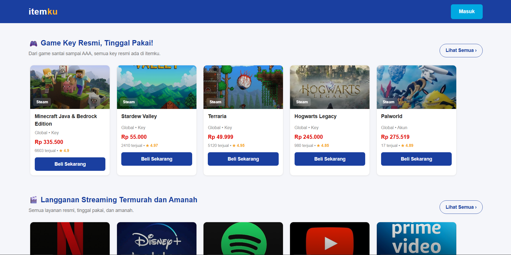
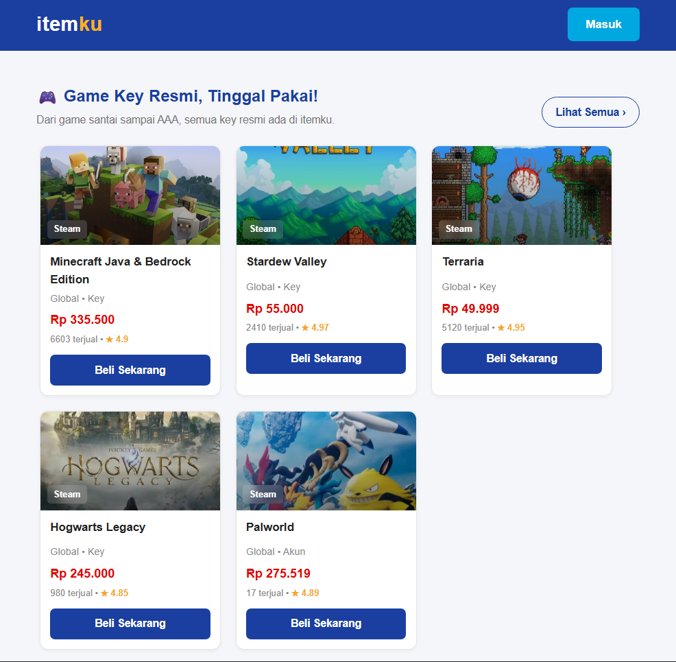

# Landing Page Itemku

Proyek ini adalah website sederhana hasil slicing halaman Itemku menggunakan HTML, CSS, dan JavaScript.

---

## Tampilan

| Perangkat |                Gambar                 |
| :-------- | :-----------------------------------: |
| Laptop    |  |
| Tablet    |  |
| HP        |          |

---

## Fitur

- Menampilkan daftar game key dan akun streaming yang dijual
- Tampilan responsif untuk layar laptop, tablet, dan HP.
- Menu navigasi otomatis ringkas di layar HP dan hanya menampilkan tombol Masuk.
- Tombol Beli menampilkan pop up pesan untuk memasukkan Email pembeli.
- Tombol Masuk menampilkan pop up pengiriman kode OTP ke email pengguna.

---

## Teknologi yang Digunakan

- HTML
- CSS
- JavaScript
- Vercel (Deployment)
